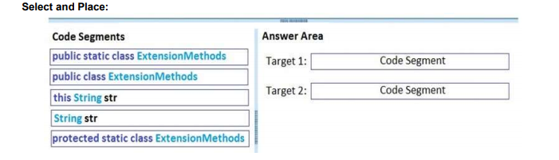
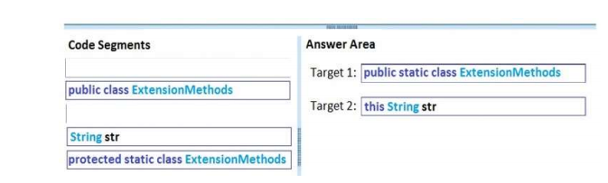
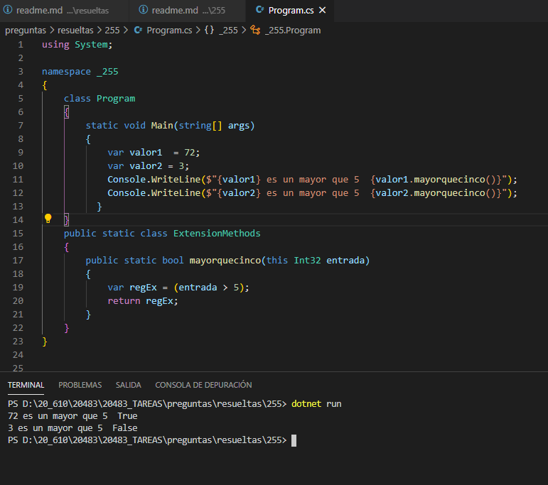

### QUESTION 255 

##### Metodos de extension

You are developing a class named ExtensionMethods.  
You need to ensure that the ExtensionMethods class implements the IsEmail() extension method on string objects.  
You have the following code  

Which code segments should you include in Target 1 and Target 2 to complete the code? To answer, drag the
appropriate code segments to the correct targets. Each code segment may be used once, more than once, or
not at all. You may need to drag the split bar between panes or scroll to view content.  
NOTE: Each correct answer is worth one point.  

Nota:

el metodo siempre debe ser estatico y público.  
El parametro debe ser del tipo this Clase nameparametro

Para el ejemplo: he creado un metodo esmayorquecinco para Int32

