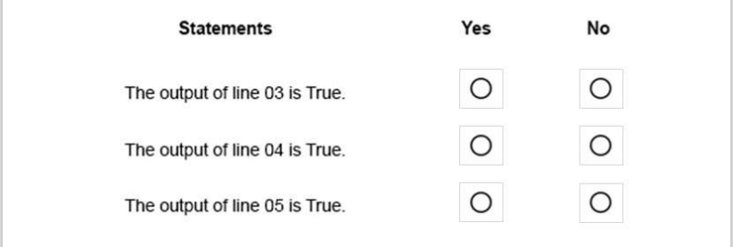
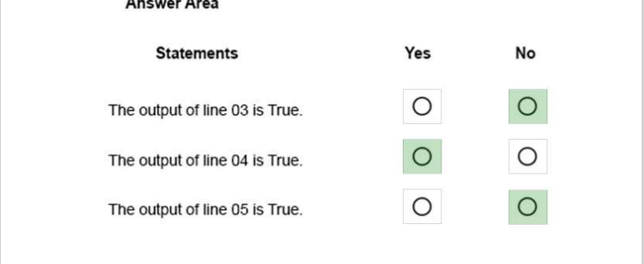

### QUESTION 257

##### Operadores de incremento/decremento/comparación (comparación perezosa)

(correspondía a JuanRa)

You have the following C# code. (Line numbers are included for reference only.)

OJO PORQUE LA SOLUCION DEL PDF ESTA MAL

```c#

01  int a=1;
02  int b=2;
03  Console.WriteLine (a == --b && a ==b++);
04  Console.WriteLine (a == --b || a ==b++);
05  Console.WriteLine (a == --b && b ==a++);
```





OJO ESTA MAL!!!!


SOLUCION


Eplicación:

a==--b primero decrementa y luego compara

a ==b++ primero compara y luego incrementa

(condicion1 || condicion2 || condicion3) al ser OR si la primera condicion es True ya no sigue evaluando porque es un OR.


Pasos
````

01  int a=1;

02  int b=2;

03  Console.WriteLine (a == --b && a ==b++);

es equivalente a 

b--;

a==b True (1==1)

a==b True

True && True == True

b++;

aqui a=1 b = 2


04  Console.WriteLine (a == --b || a ==b++);

es equivalente a 

b--;

a==b True (1==1)

COMO ES UN OR YA NO EVALUO EL RESTO 

aqui a=1 b=1


05  Console.WriteLine (a == --b && b ==a++);

b--;  (b=0)

a==b FALSO

Como es un AND no sigue evaluando


finalmente a=1 b=0

````

