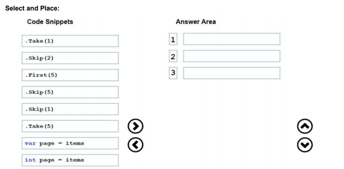
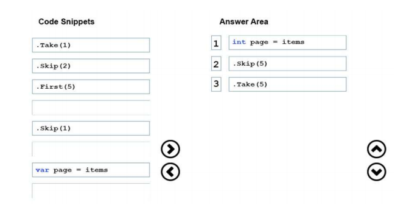
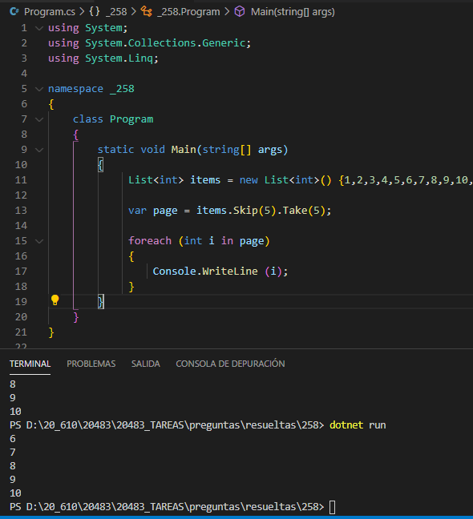

### QUESTION 258

##### Linq Take(), Skip()  __ERRATA__

You have an application that uses paging. Each page displays five items from a list.
You need to display the second page.  
Which three code blocks should you use to develop the solution? To answer, move the appropriate code blocks
from the list of code blocks to the answer area and arrange them in the correct order.  

Solucion:  __ERRATA__ __ERRATA__ __ERRATA__

La errata está en 1) int page = items    // no devulve int !!! 

CORRECTA
 var page = items
    .Skip(5)
    .Take(5)

Take(numero)   devuelve numero de elementos  
Skip (numero)  salta numero de elementos  
First(numero)  primeros cinco elementos  

ref:

https://stackoverflow.com/questions/2380413/paging-with-linq-for-objects