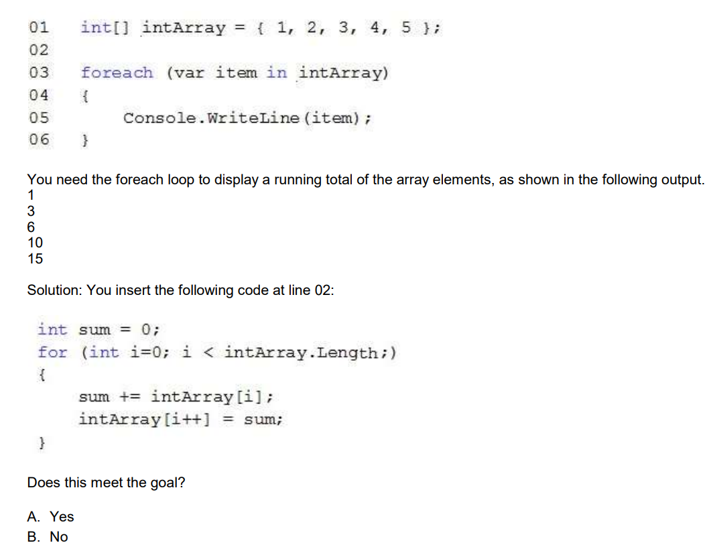

## QUESTION 264 __ERRATA__  __ERRATA__ 
Note: This question is part of a series of questions that present the same scenario. Each question in
the series contains a unique solution that might meet the stated goals. Some question sets might have
more than one correct solution, while others might not have a correct solution.  
After you answer a question in this section, you will NOT be able to return to it. As a result, these
questions will not appear in the review screen.  
You have the following C# code. (Line numbers are included for reference only.)  



CORRECT ANSWER A __ERRATA__  __ERRATA__   __ERRATA__  __ERRATA__   __ERRATA__ 

RESPUESTA CORRECTA B NO

```
for (int i =0; i < Array.Length; i++)
        {
            suma += Array[i]; 
            Array[i++]= suma;  // Mala cosa lo de hacer i++ dentro del bucle 
        }
````

Salida

1  2  4   4  9   