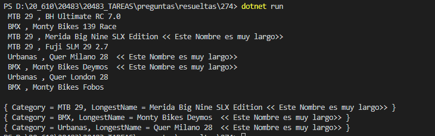

### QUESTION 274

##### LINQ GROUP __ERRATA___ 

You have a collection of Product objects named products. Each Product has a category.  
You need to determine the longest name for each category.  
You write the following code.  

Which keyword should you use for Target 1?

A. Group  
B. Where  
C. Aggregate  
D. Select  

SOLUCION B __ERRATA__ __ERRATA__ __ERRATA__

SOLUCION C Aggregate CORRECTA

 var LongestNameByCategory = products.GroupBy(p => p.Category)
.Select(g => new {Category = g.Key, LongestName =g.Select
(p => p.Name).Aggregate ((s,w) => w.Length > s.Length ? w : s  )});

