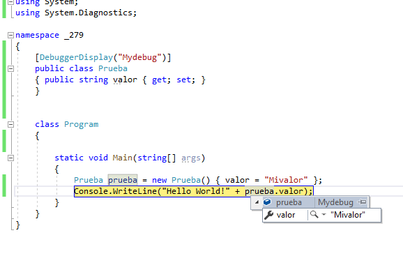

### QUESTION 279

##### DEBUG constant

You are creating an application that reads from a database.  
You need to use different databases during the development phase and the testing phase by using conditional
compilation techniques.  
What should you do?  

A. Configure the assembly metadata to use the pre-existing public key for the assembly identity by using the
AssemblySignatureKeyAttribute attribute.  
B. Decorate the code by using the [ DebuggerDisplay(“Mydebug”) ] attribute.  
C. Decorate the code by using the [ assembly:AssemblyDelaySignAttribute(true )] attribute.  
D. Configure the Define DEBUG constant setting in Microsoft Visual Studio.  

Solucion D:

La a) AssemblySignatureKeyAttribute Class Proporciona la migración de una clave de nombre seguro anterior más sencilla a una clave más grande con un algoritmo hash más seguro.  (va a ser que no)  
La b) AssemblyDelaySignAttribute  Especifica que el ensamblado no se firmó completamente al crearse.

esas dos sabemos que no tienen nada que ver 

B) el atributo DebuggerDisplay(“Mydebug”) sólo sirve para mostrar el texto cuando insepeccionamos en Debug   

Con lo cual sería la D 

La D lo que hace es separar la compilacion de Release y Debug , es decir si es Release no compila lo que este en la directiva #if DEBUG y viceversa para Release

Debug  

Release  

