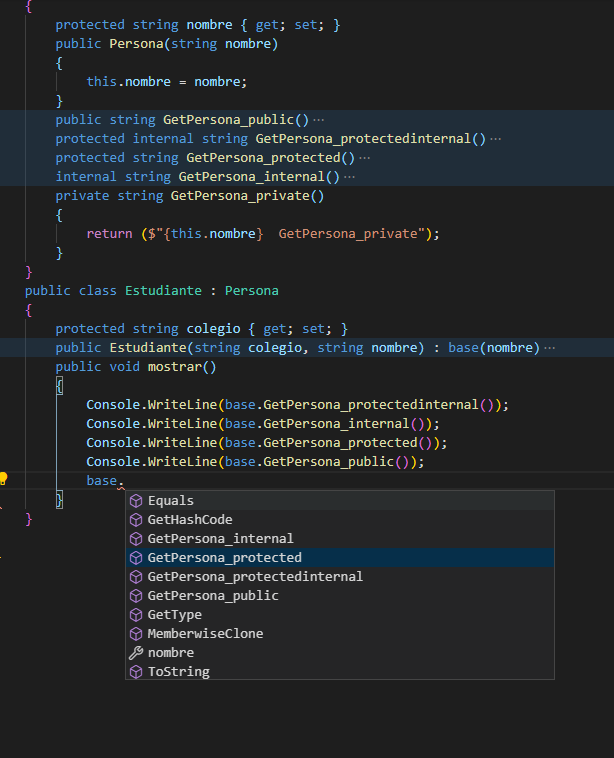

### QUESTION 44 

##### metodos de accesos (solo la clase)

An application includes a class named Person.  
The Person class includes a method named GetData.  
You need to ensure that the GetData() method **can be used only by the Person class** and **not by any class derived** from the Person class.  
Which access modifier should you use for the GetData() method?  
a. public  
b. protected internal  
c. internal  
d. private  
e. protected  

**Respuesta d. private**

Explanation/Reference:
Explanation:
The GetData() method should be private. It would then only be visible within the Person class.

| TIPO ACCESO | DETALLE |
| --- | :--- |
| public | El miembro está disponible para código que se ejecuta en cualquier ensamblado. |
| protected | El miembro está disponible solo dentro de la clase contenedora o en clases derivadas de la clase contenedora |
| internal | El miembro solo está disponible para codificar dentro del ensamblado actual. |
| protected internal | El miembro está disponible para cualquier código dentro del ensamblado actual y para los tipos derivados de la clase contenedora en cualquier ensamblado. |
| private | El miembro está disponible solo dentro de la clase contenedora. |
| private protected | El miembro está disponible para los tipos derivados de la clase contenedora, pero solo dentro de su ensamblado contenedor. (Solo disponible desde Visual C # 7.2). |

Los miembros de una clase son privados de forma predeterminada.   
Los miembros privados no son heredados por clases derivadas.  
Si desea que los miembros que de otro modo serían privados sean accesibles para las clases derivadas, debe anteponer al miembro la palabra clave protected.

