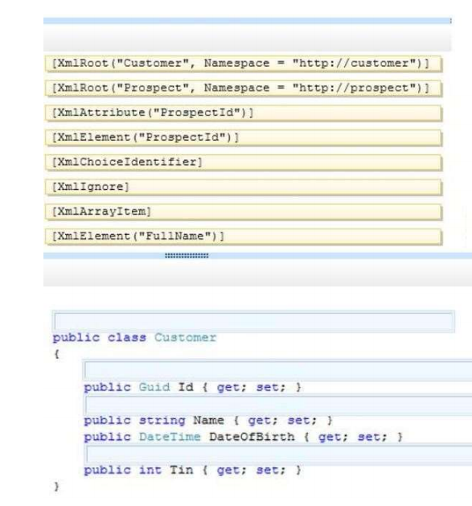
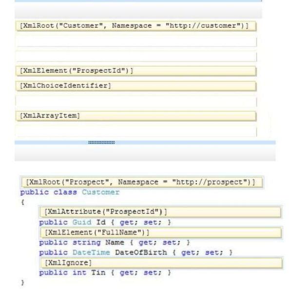
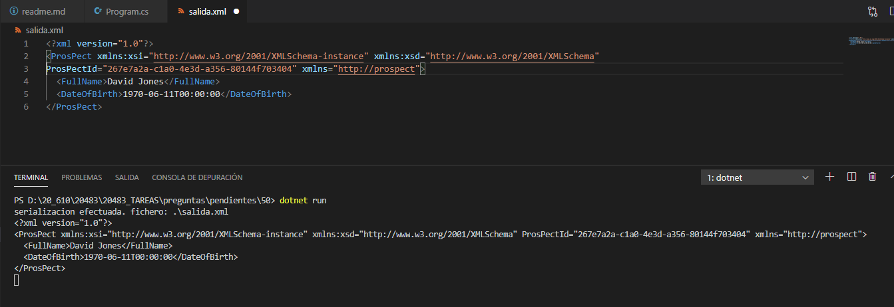

### QUESTION 50 

##### XmlSerializer

You are developing an application that includes a class named Customer.  
The application will output the Customer class as a structured XML document by using the following code segment:


You need to ensure that the Customer class will serialize to XML.  
How should you complete the relevant code? (To answer, drag the appropriate code segments to the correct
locations in the answer area. Each code segment may be used once, more than once, or not at all. You may
need to drag the split bar between panes or scroll to view content.)   
Select and Place:  




Solución

```c#

[XmlRoot("ProsPect", Namespace="http://prospect")]
public class Customer {
    [XmlAttribute("ProsPectId")]]
    public Guid Id {get;set;}
    [XmlElement("FullName")]
    public string Name {get:set;}
    public Datetime DateOfBirth {get;set;}
    [XmlIgnore]
    public int tin Tget;set;}
}
````




Explanation/Reference:
Explanation:
References: http://msdn.microsoft.com/en-us/library/3dkta8ya.aspx





````c#

using System;
using System.IO;
using System.Xml.Serialization;
 
namespace _50
{
    class Program
    {
        static void Main(string[] args)
        {
           // se trata de serializar a un xml con el mismo formato que la pregunta
           Customer customer = new Customer("David Jones", DateTime.Parse("1970-06-11"));
    	   XmlSerializer s =  new XmlSerializer(typeof(Customer));
           FileStream buffer = File.Create(@".\salida.xml");
           s.Serialize(buffer,customer);
           buffer.Close();
           Console.WriteLine(@"serializacion efectuada. fichero: .\salida.xml ");

            string readText = File.ReadAllText(@".\salida.xml");
            Console.WriteLine(readText);
            Console.ReadKey();

        }
    }

    [XmlRoot("ProsPect", Namespace="http://prospect")]
    public class Customer {
        [XmlAttribute("ProsPectId")]
        public Guid Id {get;set;}
        [XmlElement("FullName")]
        public string Name {get;set;}
        public DateTime DateOfBirth {get;set;}
        [XmlIgnore]
         public int tin {get;set;}
    
        public Customer () {}  

        public Customer (string name, DateTime dateofbirth){
            this.Name = name;
            this.DateOfBirth = dateofbirth;
            this.tin = 0;
            this.Id = Guid.NewGuid();
        }
    
    }

}
````

