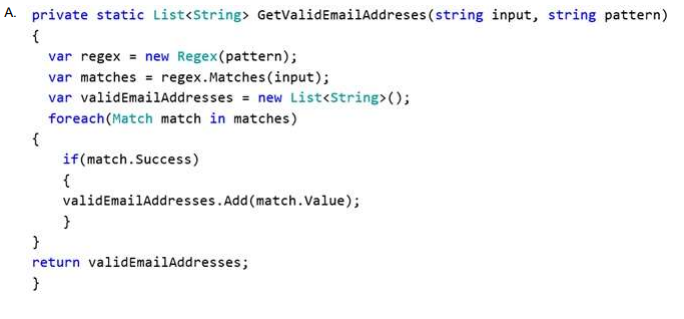

## QUESTION 57 __ERRATA__ __ERRATA__ 

You are implementing a method named GetValidEmailAddresses. The GetValidEmailAddresses ()
method processes a list of string values that represent email addresses.  
The GetValidEmailAddresses () method must return only email addresses that are in a valid format.
You need to implement the GetValidEmailAddresses() method.  
Which two code segments can you use to achieve this goal? Each correct answer presents a complete
solution.  
NOTE: Each correct selection is worth one point.  

RESPUESTA BC __ERRATA__ __ERRATA__ __ERRATA__ __ERRATA__ __ERRATA__ __ERRATA__

CORRECTA A y C

B es igual que la A con la diferencia de if !(match.Success) asi que poco va a insertar.
D devuelve Sucess es decir en caso de que la encuentre True

Salida de la prueba

prueba con john@doe.com
Opción: A    :   resultado :john@doe.com
Opción: B    :   
Opción: C    :   resultado :john@doe.com
Opción: D    :   resultado :True
prueba con pepe@pepe@pepe
Opción: A    :   
Opción: B    :   
Opción: C    :   
Opción: D    :
