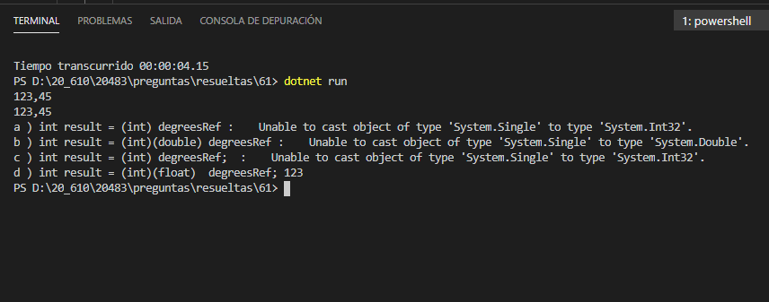

### QUESTION 19 

##### Sintaxis casts

(correspondía a Laura)

You are implementing a method named FloorTemperature that performs conversions between value types
and reference types. The following code segment implements the method. (Line numbers are included for
reference only.)


```c#
01	public static void FloorTemperature(float degrees)
02	{
03		object degreesRef = degrees;
04		
05		Console.WriteLine(result);
06	}
````

You need to ensure that the application does not throw exceptions on invalid conversions.
Which code segment should you insert at line 04?


a) int result = (int) degreesRef;

b) int result = (int)(double) degreesRef;

c) int result = (int) degreesRef;

d) int result = (int)(float)  degreesRef;


Respuesta correcta :  d) int result = (int)(float)  degreesRef;
el resto exceptiones





