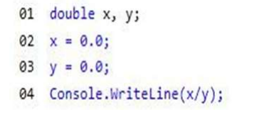

# QUESTION 67 __ERRATA__

You have the following code. (Line numbers are included for reference only.)

What is the output of line 04?  
A. Error  
B. 0  
C. null  
D. NaN  

RESPUESTA A __ERRATA__ __ERRATA__ __ERRATA__ __ERRATA__ __ERRATA__

Respuesta correcta D Nan

double (0.00d/0.00d); NaN  
float  (0.00f/0.00f); NaN  
decimal (0.00m/0.00m); Attempted to divide by zero.  
integer (0/0); Attempted to divide by zero.  