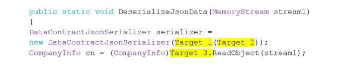
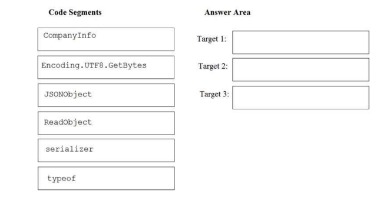
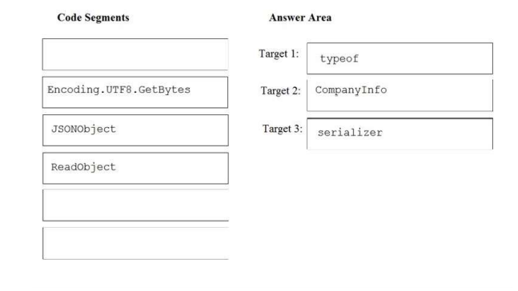
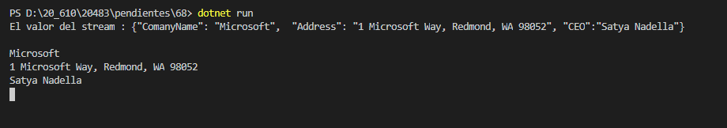

### QUESTION 68

##### DataContractJsonSerializaer

You have the following code



You need to deserialize the stream1 parameter into the CompanyInfo class.  
How should you complete the code? To answer, drag the appropriate code elements to the correct targets.  

Each code element may be used once, more than once, or not at all. You may need to drag the split bar
between panes or scroll to view content.  
NOTE: Each correct selection is worth one point. 




Solución




 
```c#
public static void DeseriallizaJsonData (MemoryStream stream1)
{
	DataContractJsonSerializer serializer = 
		new DataContractJsonSerializer( typeof (CompanyInfo));
	CompanyInfo cn = (CompanyInfo) serializer.ReadObject (stream);
````

Esta es más o menos sencilla seiralizer es el nombre de la instancia DataContractJsonSerializer  
y CompanyInfo es la clase del objeto a serializar


Codigofuentedelaprueba
````c#
using System;
using System.IO;
using System.Runtime.Serialization;
using System.Runtime.Serialization.Json;
using static System.Console;
namespace _68
{
    class Program
    {
        static void Main(string[] args)  //Crearemos un Memory Stream con el json serializado para que lo deserialice
        {
            MemoryStream ms = new MemoryStream();
            StreamWriter sw = new StreamWriter(ms);
            sw.WriteLine("{\"ComanyName\": \"Microsoft\",  \"Address\": \"1 Microsoft Way, Redmond, WA 98052\", \"CEO\":\"Satya Nadella\"} ");
            sw.Flush();


            StreamReader sr = new StreamReader(ms);
            /* Ojo antes de leerlo siempre   ms.Position = 0;  */
            ms.Position = 0;
            WriteLine($"El valor del stream : {sr.ReadToEnd()}");

            /* Lo vuelvo a ms.Position = 0;  ya que si no me dará un error de no encontrar root al deserialiar*/
            ms.Position = 0;
            DeseriallizeJsonData(ms);
            sr.Dispose();
            sw.Dispose();
            ms.Dispose();

          }

        public static void DeseriallizeJsonData(MemoryStream stream1)  // Como vemos esta es la respuesta
        {
            DataContractJsonSerializer serializer
              = new DataContractJsonSerializer(typeof(CompanyInfo));
            CompanyInfo cn = serializer.ReadObject(stream1) as CompanyInfo;
            WriteLine(cn.ComanyName);
            WriteLine(cn.Address);
            WriteLine(cn.CEO);
        }

    }
    [Serializable]
    public class CompanyInfo : ISerializable  //Implementar ISerializable
    {
        public string ComanyName { get; set; }
        public string Address { get; set; }
        public string CEO { get; set; }

        public CompanyInfo() { }    //Debe existir constructor por defecto


        public CompanyInfo(SerializationInfo info, StreamingContext ctxt) // implementar este tipo de constructor
        {
            this.ComanyName
            = info.GetValue("ComanyName", typeof(string)).ToString();
            this.Address
            = info.GetValue("Address", typeof(string)).ToString();
            this.CEO
            = info.GetValue("CEO", typeof(string)).ToString();

        }

        public void GetObjectData(SerializationInfo info, StreamingContext context) //implementar el metodo de la interface
        {
            info.AddValue("ComanyName", this.ComanyName);
            info.AddValue("Address", this.Address);
            info.AddValue("CEO", this.CEO);
        }
    }
}
````

