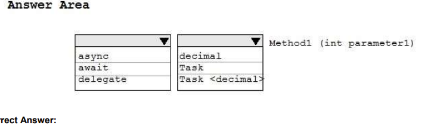
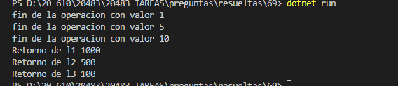

### QUESTION 69

#### async / await ERRATA!!!!!!!!!!

You are developing a method named Method1 for a class named Class1.  
The method receives an integer parameter named Parameter1 and returns to a decimal value.   
You need to ensure that calls to Method1 support being executed on separate threads.  
How should you complete the method signature? To answer, select the appropriate options in the answer area.  




Solución


`

OJO PORQUE ES ERRATA
la solición es

```c#
 async Task<decimal> Method1(int parameter1)
````
The method receives an integer parameter named Parameter1 and ***returns to a decimal*** value.

Explanation/Reference:
Reference: https://docs.microsoft.com/en-us/dotnet/csharp/async


````c#

using System;
using System.Threading.Tasks;
using System.Threading;

namespace _69
{
    class Program
    {
        static   void Main(string[] args)
        {
            var l1 =   Class1.Method1(10);
            var l2 =   Class1.Method1(5);
            var l3 =   Class1.Method1(1);
             Console.WriteLine($"Retorno de l1 { l1.Result}");
             Console.WriteLine($"Retorno de l2 { l2.Result}");
             Console.WriteLine($"Retorno de l3 { l3.Result}");
        }

 
}
    public static class Class1 {
        public static async Task<decimal> Method1(int parameter1)
        {
             await Task.Run(() =>
               {
                 // Simulate a long-running task.
                  Thread.Sleep(parameter1 * 100);
                
               });
            Console.WriteLine($"fin de la operacion con valor {parameter1}");
            return (decimal) parameter1 * 100;
        }
    }
}

````

Observa async ya que el valor 1 es la última llamada pero es la primera en terminar  
