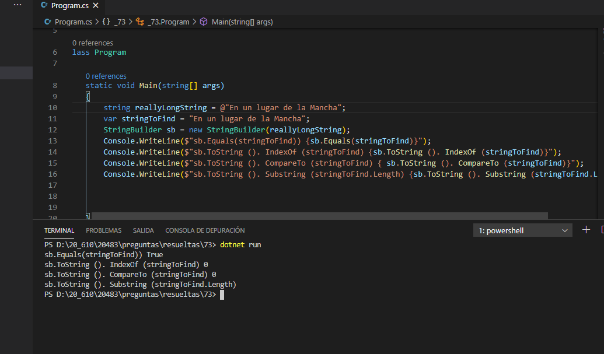

### QUESTION 73

##### StringBuilder

(correspondía a Rebeca)

You have the following C# code.

```c#
StringBuilder sb = new StringBuilder(reallyLongString);
```

The reallyLongString variable is a string in which a very long string is stored.

You need to identify whether a string stored in an object named StringToFind is within the StringBuilder
sb object.

Which code should you use?

A. sb.Equals(stringToFind);

B. sb.ToString().IndexOf(stringToFind);

C. sb.ToString().CompareTo(stringToFind);

D. sb.ToString().Substring(stringToFind.Length);


=============================

RESPUESTA: A 

=============================

Ojo aqui lo que me dicen es si una cadenda que esta en esta variable StringToFind se encuentra dentro del StringBuilder


https://docs.microsoft.com/en-us/dotnet/api/system.text.stringbuilder.equals?view=netframework-4.7.2#System_Text_StringBuilder_Equals_System_Text_StringBuilder_


SOLUCION




