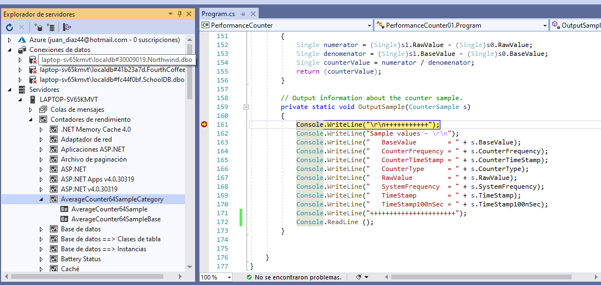
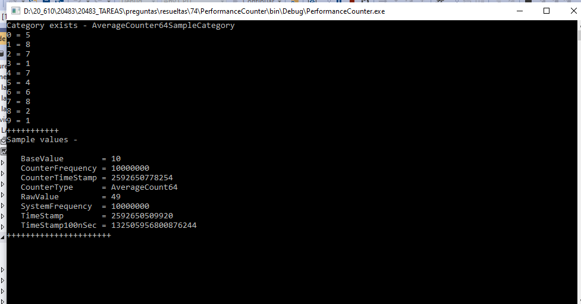

### QUESTION 74

#####  performance counter  


You are developing an application by using C#. The application will process several objects per second.  
You need to create a performance counter to analyze the object processing.  
Which three actions should you perform in sequence? (To answer, move the appropriate actions from the list of
actions to the answer area and arrange them in the correct order.)


Solución


Explanation/Reference:
Explanation:
Note:
Example:
CounterCreationDataCollection counterDataCollection = new CounterCreationDataCollection(); // Box1  
// Add the counter. Box 1  
CounterCreationData averageCount64 = new CounterCreationData();  
averageCount64.CounterType = PerformanceCounterType.AverageCount64;  
averageCount64.CounterName = "AverageCounter64Sample";  
counterDataCollection.Add(averageCount64);  
// Add the base counter.  
CounterCreationData averageCount64Base = new CounterCreationData();  
averageCount64Base.CounterType = PerformanceCounterType.AverageBase;  
averageCount64Base.CounterName = "AverageCounter64SampleBase";  
counterDataCollection.Add(averageCount64Base); // Box 2  
// Create the category. Box 3  
PerformanceCounterCategory.Create("AverageCounter64SampleCategory",  
"Demonstrates usage of the AverageCounter64 performance counter type.",  
PerformanceCounterCategoryType.SingleInstance, counterDataCollection);]  


Ejemplo de Código  
VisualStudio 2019 Abrir como Adminstrador
Mirar el código SetupCategory()


````c#

using System;
using System.Collections.Generic;
using System.Linq;
using System.Text;
using System.Threading.Tasks;
using System.Diagnostics;
using System.Collections;

using System.Collections.Specialized;

namespace PerformanceCounter01
{
    class Program
    {
        private static PerformanceCounter avgCounter64Sample;
        private static PerformanceCounter avgCounter64SampleBase;

        static void Main(string[] args)
        {
            ArrayList samplesList = new ArrayList();

            // If the category does not exist, create the category and exit.
            // Performance counters should not be created and immediately used.
            // There is a latency time to enable the counters, they should be created
            // prior to executing the application that uses the counters.
            // Execute this sample a second time to use the category.
            if (SetupCategory())
                return;
            CreateCounters();
            CollectSamples(samplesList);
            CalculateResults(samplesList);


        }


        private static bool SetupCategory()
        {
            if (!PerformanceCounterCategory.Exists("AverageCounter64SampleCategory"))
            {
                // En la pregunta BOX 01
                CounterCreationDataCollection counterDataCollection = new CounterCreationDataCollection();

				
				 // En la pregunta BOX 02
                // Add the counter.
                CounterCreationData averageCount64 = new CounterCreationData();
                averageCount64.CounterType = PerformanceCounterType.AverageCount64;
                averageCount64.CounterName = "AverageCounter64Sample";
                counterDataCollection.Add(averageCount64);

                // Add the base counter.
                CounterCreationData averageCount64Base = new CounterCreationData();
                averageCount64Base.CounterType = PerformanceCounterType.AverageBase;
                averageCount64Base.CounterName = "AverageCounter64SampleBase";
                counterDataCollection.Add(averageCount64Base);

				
				// En la pregunta BOX 03
                // Create the category.
                PerformanceCounterCategory.Create("AverageCounter64SampleCategory",
                    "Demonstrates usage of the AverageCounter64 performance counter type.",
                    PerformanceCounterCategoryType.SingleInstance, counterDataCollection);

                return (true);
            }
            else
            {
                Console.WriteLine("Category exists - AverageCounter64SampleCategory");
                return (false);
            }
        }

        private static void CreateCounters()
        {
            // Create the counters.

            avgCounter64Sample = new PerformanceCounter("AverageCounter64SampleCategory",
                "AverageCounter64Sample",
                false);


            avgCounter64SampleBase = new PerformanceCounter("AverageCounter64SampleCategory",
                "AverageCounter64SampleBase",
                false);

            avgCounter64Sample.RawValue = 0;
            avgCounter64SampleBase.RawValue = 0;
        }
        private static void CollectSamples(ArrayList samplesList)
        {

            Random r = new Random(DateTime.Now.Millisecond);

            // Loop for the samples.
            for (int j = 0; j < 100; j++)
            {

                int value = r.Next(1, 10);
                Console.Write(j + " = " + value);

                avgCounter64Sample.IncrementBy(value);

                avgCounter64SampleBase.Increment();

                if ((j % 10) == 9)
                {
                    OutputSample(avgCounter64Sample.NextSample());
                    samplesList.Add(avgCounter64Sample.NextSample());
                }
                else
                {
                    Console.WriteLine();
                }

                System.Threading.Thread.Sleep(50);
            }
        }

        private static void CalculateResults(ArrayList samplesList)
        {
            for (int i = 0; i < (samplesList.Count - 1); i++)
            {
                // Output the sample.
                OutputSample((CounterSample)samplesList[i]);
                OutputSample((CounterSample)samplesList[i + 1]);

                // Use .NET to calculate the counter value.
                Console.WriteLine(".NET computed counter value = " +
                    CounterSampleCalculator.ComputeCounterValue((CounterSample)samplesList[i],
                    (CounterSample)samplesList[i + 1]));

                // Calculate the counter value manually.
                Console.WriteLine("My computed counter value = " +
                    MyComputeCounterValue((CounterSample)samplesList[i],
                    (CounterSample)samplesList[i + 1]));
            }
        }

        //++++++++//++++++++//++++++++//++++++++//++++++++//++++++++//++++++++//++++++++
        //    Description - This counter type shows how many items are processed, on average,
        //        during an operation. Counters of this type display a ratio of the items
        //        processed (such as bytes sent) to the number of operations completed. The
        //        ratio is calculated by comparing the number of items processed during the
        //        last interval to the number of operations completed during the last interval.
        // Generic type - Average
        //      Formula - (N1 - N0) / (D1 - D0), where the numerator (N) represents the number
        //        of items processed during the last sample interval and the denominator (D)
        //        represents the number of operations completed during the last two sample
        //        intervals.
        //    Average (Nx - N0) / (Dx - D0)
        //    Example PhysicalDisk\ Avg. Disk Bytes/Transfer
        //++++++++//++++++++//++++++++//++++++++//++++++++//++++++++//++++++++//++++++++
        private static Single MyComputeCounterValue(CounterSample s0, CounterSample s1)
        {
            Single numerator = (Single)s1.RawValue - (Single)s0.RawValue;
            Single denomenator = (Single)s1.BaseValue - (Single)s0.BaseValue;
            Single counterValue = numerator / denomenator;
            return (counterValue);
        }

        // Output information about the counter sample.
        private static void OutputSample(CounterSample s)
        {
            Console.WriteLine("\r\n+++++++++++");
            Console.WriteLine("Sample values - \r\n");
            Console.WriteLine("   BaseValue        = " + s.BaseValue);
            Console.WriteLine("   CounterFrequency = " + s.CounterFrequency);
            Console.WriteLine("   CounterTimeStamp = " + s.CounterTimeStamp);
            Console.WriteLine("   CounterType      = " + s.CounterType);
            Console.WriteLine("   RawValue         = " + s.RawValue);
            Console.WriteLine("   SystemFrequency  = " + s.SystemFrequency);
            Console.WriteLine("   TimeStamp        = " + s.TimeStamp);
            Console.WriteLine("   TimeStamp100nSec = " + s.TimeStamp100nSec);
            Console.WriteLine("++++++++++++++++++++++");
            Console.ReadLine ();
        }


    }
}

`````  

  
  

