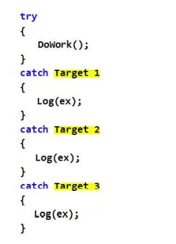
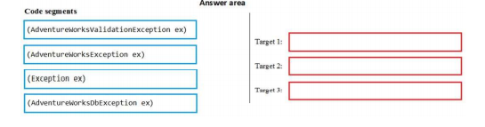
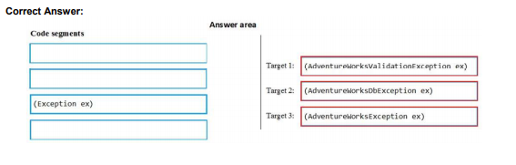
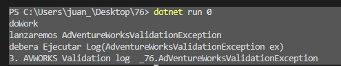
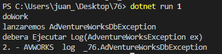
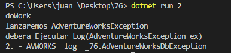
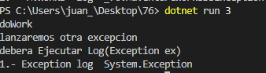

## Question 76  __ERRATA__

You are developing an application that implements a set of custom exception types. You declare the custom exception types by using the following code segments:  


````
public class AdVentureWorksException : System.Exception{}  

public class AdVentureWorksDbException : AdVentureWorksException {}    

public class AdVentureWorksValidationException : AdVentureWorksException {}  

````


The application includes a function named DoWork that throws .NET Framework exceptions and custom exceptions. The application contains only the following logging methods:

````
static void Log (Exception ex) {....}
static void Log (AdVentureWorksException ex) {}
static void Log (AdVentureWorksValidationException ex) {}
````

The application must meet the following requirements:


. When __AdventureWorksValidationException__ exceptions are caught, log the information by using the static void __Log(AdventureWorksValidationException ex)__ method.
. When __AdventureWorksDbException__ or __other AdventureWorksException exceptions__ are caught, log the information by using the static void _Log(AdventureWorksException ex)__ method.


You need to meet the requirements.  
You have the following code:  

  

Which code segments should you include in Target 1, Target 2, and Target 3 to complete the code? To
answer, drag the appropriate code segments to the correct targets. Each code segment may be used once,
more than once, or not at all. You may need to drag the split bar between panes or scroll to view content.  
NOTE: Each correct selection is worth one point.  

  


SOLUCION __ERRATA__ __ERRATA__ __ERRATA__ __ERRATA__ __ERRATA__ __ERRATA__

Con esta solución nunca capturaremos excepciones de otro tipo.

  

---


SOLCUCION CORRECTA

````
static void Main(string[] args)
        {
            try 
            {
               DoWork(args[0]);
            }

            catch (AdVentureWorksValidationException ex )  // se produce cuando AdVentureWorksValidationException
            {
                Log(ex );   // lamada a Log (AdVentureWorksValidationException ex)
            }
            catch (AdVentureWorksException ex ) // se produce cuando (AdVentureWorksException ó AdVentureWorksDbException
            {
                Log(ex);  // llamada a Log (AdVentureWorksException ex)
            }
            catch (Exception ex ) // Se produce en otro caso
            {
                Log(ex); // llamada a Log (Exception ex)
            }
        }
````


Para probar lanzamos dotnet run 0  

  

Para probar lanzamos dotnet run 1  
  

Para probar lanzamos dotnet run 2  
    

Para probar lanzamos dotnet run 3  
  