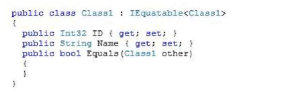
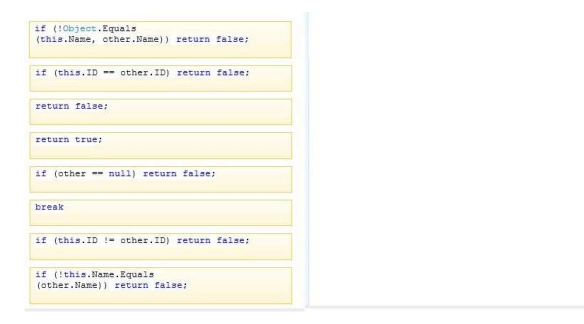
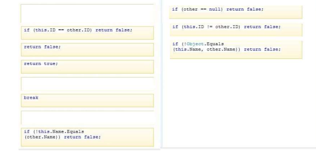

### QUESTION 78 

##### IEquatable<CLass1> 
Ojo Tiene una pequeña errata!


You have the following class:




You need to implement IEquatable. The Equals method must return true if both ID and Name are set to the
identical values. Otherwise, the method must return false. Equals must not throw an exception.

What should you do? (Develop the solution by selecting and ordering the required code snippets. You may not
need all of the code snippets.)

Select and Place:





Solucion





Tiene una errata!
Tal y como esta no todas las rutas devuelven un valor;
```out
ERROR al compilar.

Program.cs(20,25): error CS0161: 'Program.CLass1.Equals(Program.CLass1)': no todas las rutas de acceso de código devuelven un valor [D:\20_610\20483\preguntas\pendientes\78\78.csproj]
    0 Advertencia(s)
    1 Errores
 ```    

La solución correcta sería:


```` c#

 public bool Equals([AllowNull] CLass1 other)
            {

                if (other == null) return false;
                if (!this.Name.Equals(other.Name)) return false;
                if (this.ID != other.ID) return false;
                return true;
            }
````             


 


