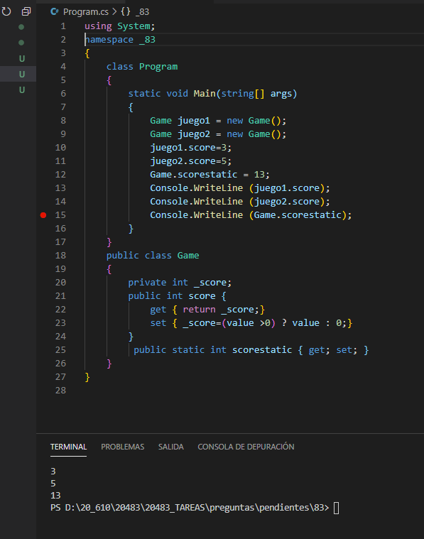

### QUESTION 83 

##### metodos de acceso 

You are creating a class named Game.  
The Game class must meet the following requirements:  
. Include a member that represents the score for a Game instance.  
. Allow external code to assign a value to the score member.  
. Restrict the range of values that can be assigned to the score member.  
You need to implement the score member to meet the requirements. In which form should you implement the score member?  

A. protected field   
B. public static field   
C. public static property   
D. public property   

Correct Answer: **D public property**  
Debe permitir que codigo externo asigne valores **public** , restringir rango de valores **property**
Si fuese static todas las instancias del game tendrían la misma puntuación

https://csharp.2000things.com/tag/static-properties/

