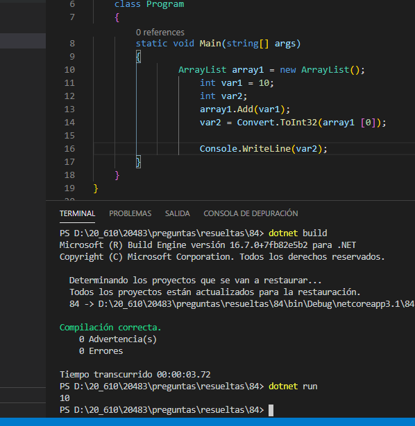

### QUESTION 84 

##### Sintaxis casts

(correspondía a Laura y es muy similar a la 95)

You are developing an application.
The application contains the following code segment. (Line numbers are included for reference only.):


```c#
01	ArrayList array1 = new ArrayList();
02	int var1 = 10;
03	int var2;
04	array1.Add(var1);	
05	var2 = array1[0];
06	 
````

When you run the code, you receive the following error message: "Cannot implicitly convert type 'object'' to 'int'.
An explicit conversion exists (are you missing a cast?)."
You need to ensure that the code can be compiled.
Which code should you use to replace line 05?


a) var2 = ((List<int> array1)) [0];

b) var2 = ((int[])array1)[0];

c) var2 = Convert.ToInt32(array1 [0]);

d) var2 = array1[0] is int;


Respuesta correcta :  c) var2 = Convert.ToInt32(array1 [0]);
el resto ni siquiera compila....

a)  'List<int>' es tipo, que no es válida en el contexto indicado [84, 84, 84]csharp(CS0119)

b)  No se puede convertir el tipo 'System.Collections.ArrayList' en 'int[]' [84]csharp(CS0030)

d)  No se puede convertir implícitamente el tipo 'bool' en 'int' [84]csharp(CS0029)





