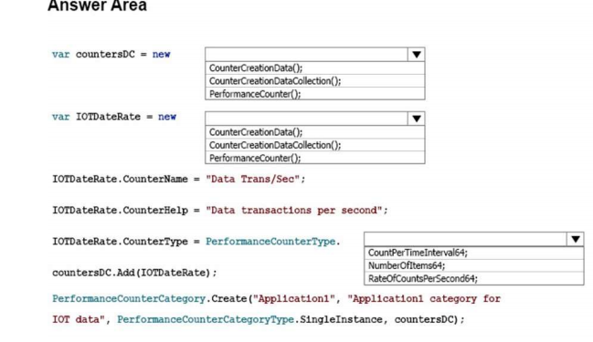
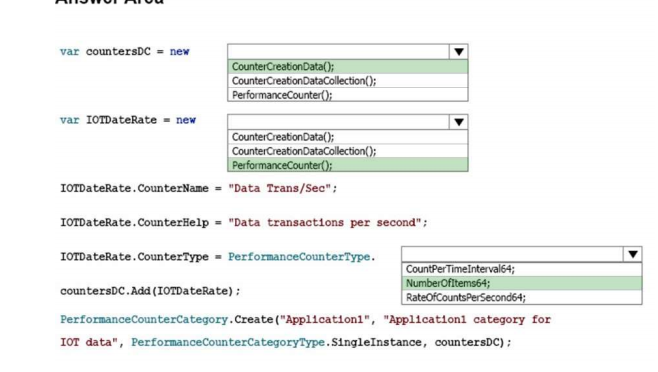
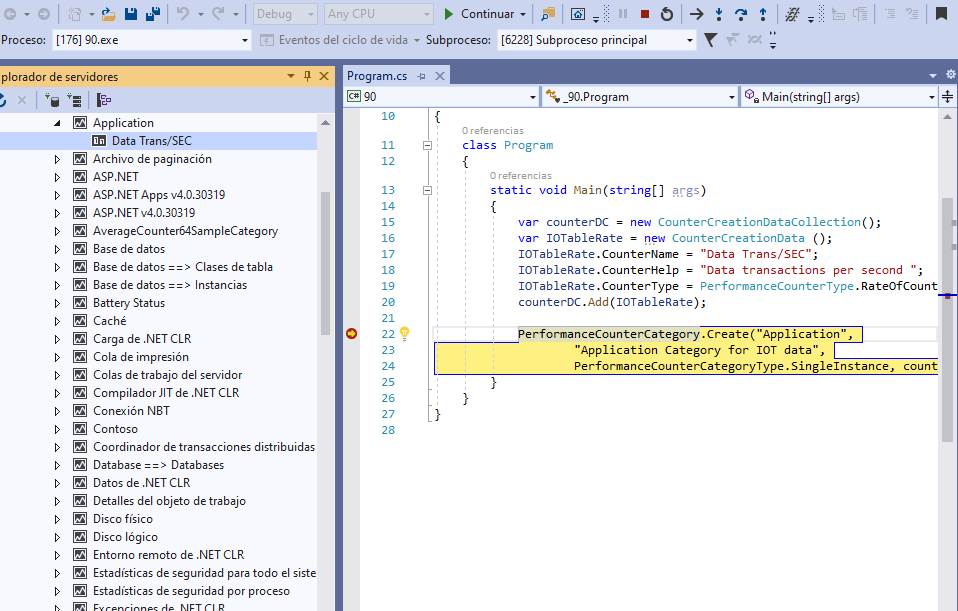

## QUESTION 90 __ERRATA__ __ERRATA__
HOTSPOT
You are creating a C# application named Application1 that will process IoT data from 100,000 devices. Each
IoT device can submit hundreds of data transactions per second.  
Application1 runs on Windows Server.  
You need to create a performance counter in Windows Server that will display the number of data transactions
processed per second.  
How should you complete the code? To answer, select the appropriate options in the answer area.  
 
NOTE: Each correct selection is worth one point.  



RESPUESTA  __ERRATA__ __ERRATA__ __ERRATA__ __ERRATA__ __ERRATA__




REPUESTA CORRECTA 
  CounterCreationDataCollection();  
  CounterCreationData();  
  RateOfCountsPerSecond64;  //Es lo logico por el contexto


Para aclarar todas las preguntas de PerfomanceCounter mira https://github.com/juanradev/20483_TAREAS/tree/main/preguntas/resueltas/74  

Hay otro tipo de preguntas sobre PerformanceCounterType

que es emplear la lógica (se crean dos dan el tipo del primero el segundo es de un tipo similar   
por ejemplo uno es de avgCounter64Sample; el segundo será del tipo avgCounter64SampleBase  
https://docs.microsoft.com/es-es/dotnet/api/system.diagnostics.performancecountertype?view=dotnet-plat-ext-5.0


````
if (!PerformanceCounterCategory.Exists("Application"))
            {
                var counterDC = new CounterCreationDataCollection();
                var IOTableRate = new CounterCreationData();
                IOTableRate.CounterName = "Data Trans/SEC";
                IOTableRate.CounterHelp = "Data transactions per second ";
                IOTableRate.CounterType = PerformanceCounterType.RateOfCountsPerSecond64;
                counterDC.Add(IOTableRate);

                PerformanceCounterCategory.Create("Application",
                        "Application Category for IOT data",
                        PerformanceCounterCategoryType.SingleInstance, counterDC);
                Console.WriteLine("categoria creada");
            }
            else
            {
                Console.WriteLine("categoria ya creada");
            }
````		
Para ejecutarlo con Visual Studio 2019 como Administrador
			

