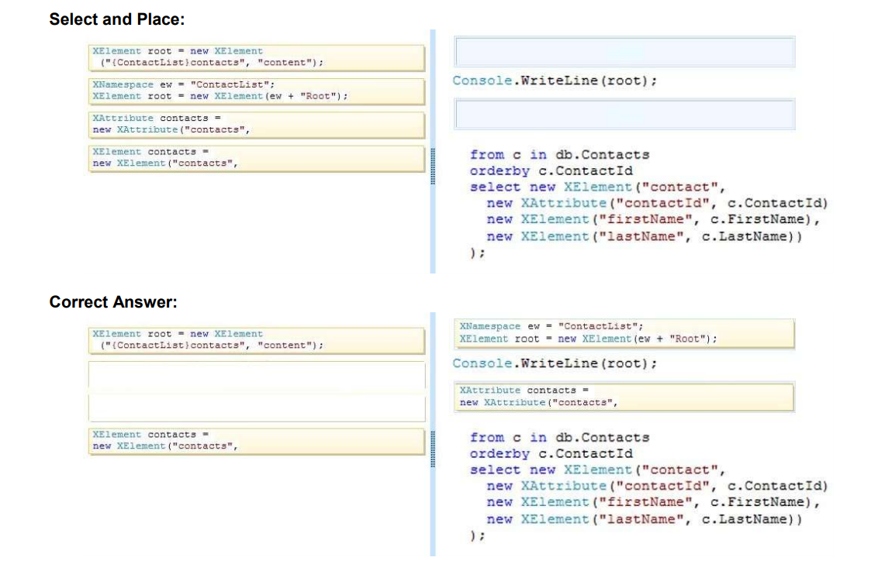

## QUESTION 91_ _ERRATA__ __ERRATA__ 
DRAG DROP  
You are developing an application that will populate an extensive XML tree from a Microsoft SQL Server 2008 R2 database table named Contacts.  
You are creating the XML tree. The solution must meet the following requirements:  
Minimize memory requirements.  
Maximize data processing speed.  
You open the database connection. You need to create the XML tree.  
How should you complete the relevant code? (To answer, drag the appropriate code segments to the correct
locations in the answer area. Each code segment may be used once, more than once, or not at all. You may
need to drag the split bar between panes or scroll to view content.)  
__ERRATA__  __ERRATA__  __ERRATA__  __ERRATA__  __ERRATA__ 

SOLUCION CORRECTA

(la cabecera está bien)
No puedo ser Atributo son Elementos  

 XNamespace ew = "ContactList";  
 XElement root = new XElement(ew + "Root");  

 XElement contacts = new __XElement__("contacts",
             from c in list
             orderby c.ContactId
             select new XElement("contact",
                new XAttribute("contactID", c.ContactId),
                new XAttribute("firstname", c.FirstName),
                new XAttribute("lastname", c.LastName)
             ));
