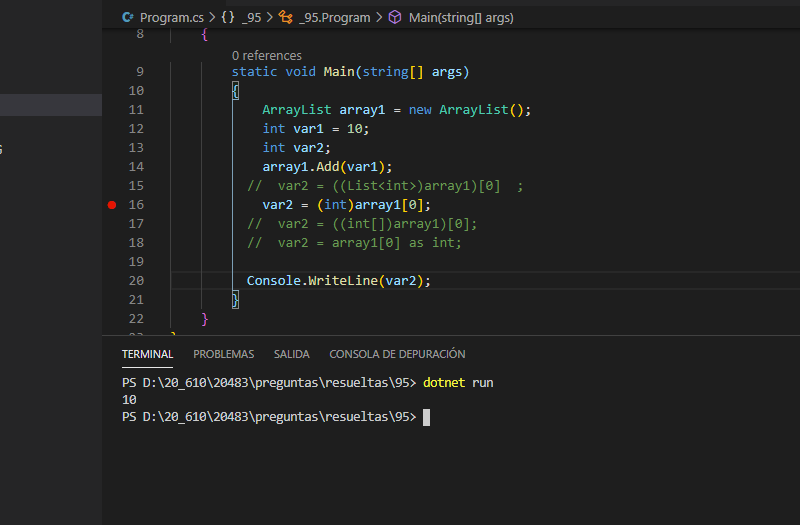

### QUESTION 95 

##### Sintaxis casts

(correspondía a Laura)

You are developing an application.
The application contains the following code segment (line numbers are included for reference only):


```c#
01	ArrayList array1 = new ArrayList();
02	int var1 = 10;
03	int var2;
04	array1.Add(var1);	
05	var2 = array1[0];
06	 
````

When you run the code, you receive the following error message: "Cannot implicitly convert type 'object'' to 'int'.
An explicit conversion exists (are you missing a cast?)."
You need to ensure that the code can be compiled.
Which code should you use to replace line 05?


a) var2 = ((List<int> array1)) [0];

b) var2 = (int)array1[0];

c) var2 = ((int[])array1)[0];

d) var2 = array1[0] as int;


Respuesta correcta :  b) var2 = (int)array1[
el resto ni siquiera compila....

a)  No se puede convertir el tipo 'System.Collections.ArrayList' en 'System.Collections.Generic.List<int>' [95]csharp(CS0030)

c)  No se puede convertir el tipo 'System.Collections.ArrayList' en 'int[]' [95]csharp(CS0030)

d)  El operador as se debe usar con un tipo de referencia o un tipo que acepte valores NULL ('int' es un tipo de valor que no acepta valores NULL) [95]csharp(CS0077)





