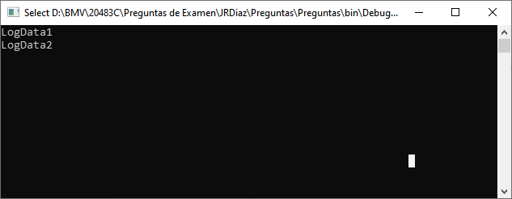
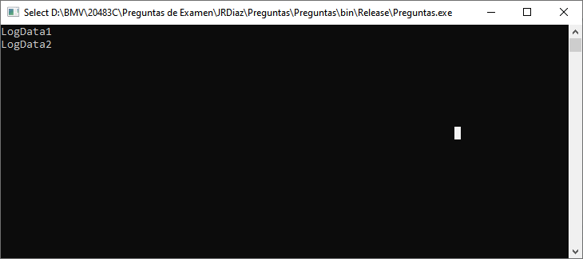

# Pregunta 229

Proyecto en de Console en .Net Framework 4.8

Código para comprobar la pregunta:

```csharp
#define DEBUG
using System;
using System.Diagnostics;
namespace Preguntas
{
    class Program
    {
        static void Main(string[] args)
        {
            Trace.Listeners.Add(new TextWriterTraceListener(Console.Out));
            Trace.AutoFlush = true;
            new TestClass().RunTestClass();
        }
    }
    public class TestClass
    {
        [Conditional("DEBUG")]
        public void LogData()
        {
            Trace.Write("LogData1\n");
        }
        public void RunTestClass()
        {
            this.LogData();
#if (DEBUG)
            Trace.Write("LogData2\n");
#endif
        }
    }
}
```

Resultado en la consola ejecuntando en módo DEBUG:




Resultado en la consola ejecutando en modo RELEASE:



Preguntas de Si o No con su respuesta:

| Statement                                                    | Yes  | No   |
| ------------------------------------------------------------ | ---- | ---- |
| When RunTestClass execute, LogData1 will be written if the application start in DEBUG mode. | X    |      |
| When RunTestClass execute, LogData2 will be written if the application start in DEBUG mode. | X    |      |
| When RunTestClass execute, LogData2 will be written if the application start in RELEASE mode. | X    |      |

Mas información: **[Seguimiento y depuración en Visual C Sharp](https://docs.microsoft.com/es-es/troubleshoot/dotnet/csharp/trace-and-debug)**


