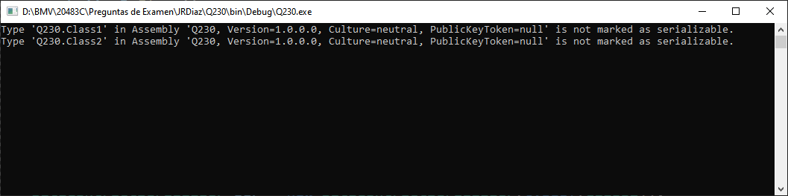

# Pregunta 230
 
OJO ERRATA EN EL PDF


Proyecto en de Console en .Net Framework 4.8

Código para comprobar la pregunta:

```csharp
using System.Runtime.Serialization;
using System.Runtime.Serialization.Formatters.Binary;
using System.Collections.Generic;
using System.IO;
using static System.Console;
namespace Q230
{
    class Program
    {
        static void Main(string[] args)
        {
            // Using Class1 to be serialized with BinaryFormatter 
            try
            {
                Class1 class1 = new Class1("_Value to class1 serialize");
                IFormatter formatter1 = new BinaryFormatter();
                FileStream buffer1 = File.Create(@".\class1.txt");
                formatter1.Serialize(buffer1, class1);
                buffer1.Close();
            }
            catch (SerializationException ex)
            {
                WriteLine(ex.Message);
            }
            // Using Class2 to be serialized with BinaryFormatter
            try
            {
                Class2 class2 = new Class2(new List<string>() { "_Value class2 to serialize" });
                IFormatter formatter2 = new BinaryFormatter();
                FileStream buffer2 = File.Create(@".\class2.txt");
                formatter2.Serialize(buffer2, class2);
                buffer2.Close();
            }
            catch (SerializationException ex)
            {
                WriteLine(ex.Message);
            }
            // Using Class3 to be serializad with DataContractSerializer
            Class2 class2_3 = new Class2(new List<string>() { "_Value class2_3 to serialize" });
            FileStream buffer3 = File.Create(@".\class2_3.txt");
            DataContractSerializer ser = new DataContractSerializer(typeof(Class2));
            ser.WriteObject(buffer3, class2_3);
            buffer3.Close();
        }
    }
    //[Serializable]
    [DataContract]
    public class Class1
    {
        string oneValue;
        [DataMember]
        public string OneValue
        {
            get => oneValue; //get { return oneValue; }
            set => oneValue = value; //{ oneValue = value; }
        }
        public Class1(string _oneValue)
        {
            oneValue = _oneValue;
        }
    }
    //[Serializable]
    [DataContract]
    public class Class2
    {
        List<string> values;
        [DataMember]
        public List<string> Values
        {
            get => values; // { return Values; }
            set => values = value; // { values = value; }
        }
        public Class2(List<string> _values)
        {
            values = _values;
        }
        public Class2() { }
    }
}
```

Resultado en la consola después de la ejecución:



Un fichero con la serialización de la Classe2 con DataContractSerializer es generado:

```xml
<Class2 xmlns="http://schemas.datacontract.org/2004/07/Q230" xmlns:i="http://www.w3.org/2001/XMLSchema-instance"><Values xmlns:a="http://schemas.microsoft.com/2003/10/Serialization/Arrays"><a:string>_Value class2_3 to serialize</a:string></Values></Class2>
```

Preguntas de Si o No con su respuesta:

| Statement                                                    | Yes  | No   |
| ------------------------------------------------------------ | ---- | ---- |
| Class1 can be serialized by using the BinaryFormatter class.(*) |      | X    |
| Class2 can be serialized by using the BinaryFormatter class.(*) |      | X    |
| Class2 can be serialized by using the DataContractSerializer class. | X    |      |

La clase debe tener el atributo **[Serializable]** para que pueda ser serializada con este formater.

